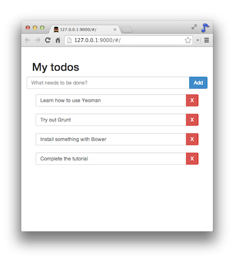

#ALLO! ALLO! LET'S SCAFFOLD A WEB APP

**By Addy Osmani, James Cryer & Pearl Chen with Annotation Tutorial by Codio**

In this code lab, you build a fully functional application using Yeoman and AngularJS. The sample app provides a brief look at some Yeoman, Grunt and Bower features. This code lab assumes that you have some programming experience.

##RUNNING THE TUTORIAL IN CODIO
Running this tutorial in Codio is a great way to learn as you will see. Installs are usually much quicker than on your laptop and you can start work without having to set up a stack. Full instruction are below.

###Video
If you prefer to sit back and watch, we have prepared a video that explains the Yeoman project

###Interactive Tutorial
If you want the hands on approach then go to the Tools->Tutorial menu option and simply follow the instructions.

https://github.com/codio/tutorial_yo_angular.git

1. Create an account on Codio and sign in. 
1. Create a new project as shown above by selecting the Git tab
1. Paste into the 'Clone a Git repo' field `https://github.com/codio/tutorial_yo_angular.git`
1. When you press 'Create Project' you will be taken straight into the IDE
1. Go to the Tools->Tutorial menu option and simply follow the instructions

##MEET YEOMAN

Yeoman is a man in a hat with three tools for improving your productivity:

[yo](http://yeoman.io/) is a scaffolding tool that offers an ecosystem of framework-specific scaffolds, called generators, that can be used to perform some of the tedious tasks I mentioned earlier.

[grunt](http://gruntjs.com/) is used to build, preview and test your project, thanks to help from tasks curated by the Yeoman team and [grunt-contrib](https://github.com/gruntjs/grunt-contrib).

[bower](http://bower.io/) is used for dependency management, so that you no longer have to manually download your front-end libraries.

With just a command or two, Yeoman can write boilerplate code for your app (or individual pieces like Models), compile your Sass, and fire up a simple web server in your current directory. It can also run your unit tests, minimize and concatenate your CSS, JS, HTML and images, plus more.

You can install generators using the [npm](http://npmjs.org/) command and there are over [450 generators](http://yeoman.io/community-generators.html) now available, many of which have been written by the open-source community. Popular generators include [generator-angular](https://github.com/yeoman/generator-angular), [generator-backbone](https://github.com/yeoman/generator-backbone) and [generator-ember](https://github.com/yeoman/generator-ember).

##TODAY’S SAMPLE YEOMAN APP: A TODO APP USING ANGULARJS

For those unfamiliar with AngularJS, it is a JavaScript framework for developing dynamic web apps. Angular is what HTML would have been if it had been designed for web apps, instead of static documents. Angular aims to simplify application development by providing high-level features like data-binding and dependency injection (DI).

To dig deeper into the sweet spots of AngularJS, take a look at the detailed [documentation](http://docs.angularjs.org/guide/overview).

Let’s dive right into building the below Todo app from scratch.

